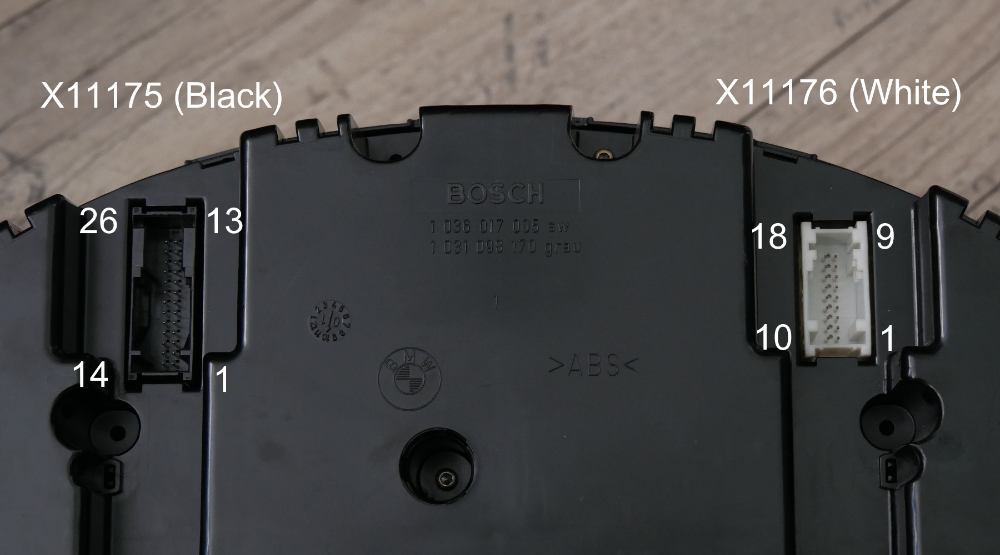

### Wiring for BMW E46 cluster
First begin by wiring your CAN interface/ESP32 board - see the main readme for details. Then follow the below instructions:

Below is the connector pinout for the BMW E46 instrument cluster:

#### **X11175 (Black)**
| Cluster pin | Connect to | Comment |
|--|--|--|
| 4, 5, 6 | +12V |
| 7 | +12V | Backlight for older IKE |
| 9 | CAN H | Connect to your can bus interface
| 10 | CAN L | Connect to your can bus interface
| 11, 12 | Fuel sim A2, A1 | Pair A for fuel simulation
| 15, 16 | Fuel sim B1, B2 | Pair B for fuel simulation
| 14 | ESP pin D17 | KBUS (Lights/symbols/backlight) - **VIA LEVEL SHIFTER**
| 19 | ESP pin D22 | Speed sensor simulation - **VIA LEVEL SHIFTER**
| 22 | ESP pin D21 | ABS light - **VIA LEVEL SHIFTER**
| 23 | ESP pin D13 | Parking brake light - **VIA LEVEL SHIFTER**
| 20, 24, 26 | GND (12V power supply) |

#### **X11176 (White)**
| Cluster pin | Connect to | Comment |
|--|--|--|
| 1, 2 | Through a NTC | Optional: outside temperature sensor |
| 4 | GND (12V power supply) | To get rid of washer fluid light |

With connections labeled with **VIA LEVEL SHIFTER**, a logic level shifter is needed to pull up the signals to 12V instead of 3.3:
- Can be found by "Logic Level Shifter Bi-Directional Four-way", with 4 signals using BSS138 mosfets
- LV pin to 3.3V || HV pin to 12V || HV1/2/3/4 goes to cluster || LV1/2/3/4 goes to ESP

For most warning lights and more to work you need to wire ESP GND to 12V power supply GND.